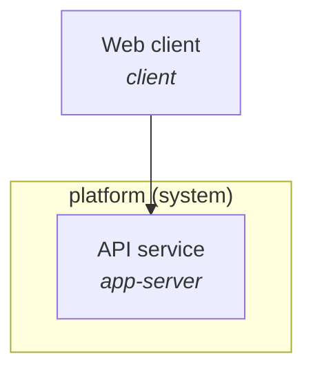
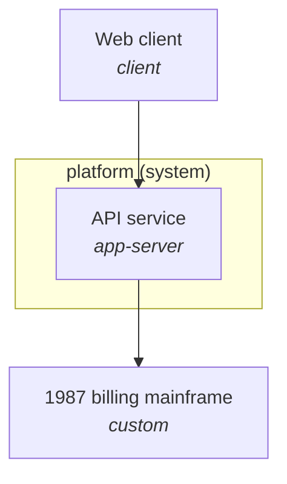

# custom-escape-hatch

Groups are subgraphs, solid edges are sync, dotted edges are async.

```mermaid
flowchart TD
  n_web_client["Web client<br/><i>client</i>"]
  subgraph n_g_platform["platform (system)"]
    n_api["API service<br/><i>app-server</i>"]
  end
  n_web_client --> n_api
```

The broken twin adds one more box, outside every boundary:

```mermaid
flowchart TD
  n_web_client["Web client<br/><i>client</i>"]
  subgraph n_g_platform["platform (system)"]
    n_api["API service<br/><i>app-server</i>"]
  end
  n_billing["1987 billing mainframe<br/><i>custom</i>"]
  n_web_client --> n_api
  n_api --> n_billing
```
