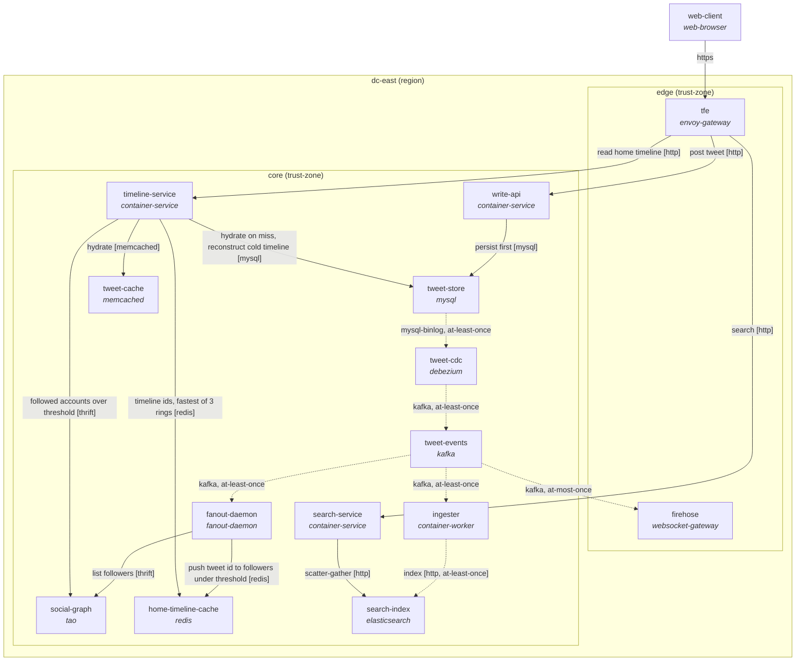

# twitter-timeline

Rendered from `design.yaml` by design_to_mermaid.py. Groups are subgraphs, solid edges are sync, dotted edges are async.

```mermaid
flowchart TD
  n_web_client["web-client<br/><i>web-browser</i>"]
  subgraph n_g_dc_east["dc-east (region)"]
    subgraph n_g_edge["edge (trust-zone)"]
      n_tfe["tfe<br/><i>envoy-gateway</i>"]
      n_firehose["firehose<br/><i>websocket-gateway</i>"]
    end
    subgraph n_g_core["core (trust-zone)"]
      n_write_api["write-api<br/><i>container-service</i>"]
      n_timeline_service["timeline-service<br/><i>container-service</i>"]
      n_search_service["search-service<br/><i>container-service</i>"]
      n_tweet_store["tweet-store<br/><i>mysql</i>"]
      n_tweet_cdc["tweet-cdc<br/><i>debezium</i>"]
      n_tweet_events["tweet-events<br/><i>kafka</i>"]
      n_fanout_daemon["fanout-daemon<br/><i>fanout-daemon</i>"]
      n_social_graph["social-graph<br/><i>tao</i>"]
      n_home_timeline_cache["home-timeline-cache<br/><i>redis</i>"]
      n_tweet_cache["tweet-cache<br/><i>memcached</i>"]
      n_ingester["ingester<br/><i>container-worker</i>"]
      n_search_index["search-index<br/><i>elasticsearch</i>"]
    end
  end
  n_web_client -->|"https"| n_tfe
  n_tfe -->|"post tweet [http]"| n_write_api
  n_tfe -->|"read home timeline [http]"| n_timeline_service
  n_tfe -->|"search [http]"| n_search_service
  n_write_api -->|"persist first [mysql]"| n_tweet_store
  n_tweet_store -.->|"mysql-binlog, at-least-once"| n_tweet_cdc
  n_tweet_cdc -.->|"kafka, at-least-once"| n_tweet_events
  n_tweet_events -.->|"kafka, at-least-once"| n_fanout_daemon
  n_fanout_daemon -->|"list followers [thrift]"| n_social_graph
  n_fanout_daemon -->|"push tweet id to followers under threshold [redis]"| n_home_timeline_cache
  n_tweet_events -.->|"kafka, at-least-once"| n_ingester
  n_ingester -.->|"index [http, at-least-once]"| n_search_index
  n_tweet_events -.->|"kafka, at-most-once"| n_firehose
  n_timeline_service -->|"timeline ids, fastest of 3 rings [redis]"| n_home_timeline_cache
  n_timeline_service -->|"followed accounts over threshold [thrift]"| n_social_graph
  n_timeline_service -->|"hydrate [memcached]"| n_tweet_cache
  n_timeline_service -->|"hydrate on miss, reconstruct cold timeline [mysql]"| n_tweet_store
  n_search_service -->|"scatter-gather [http]"| n_search_index
```
